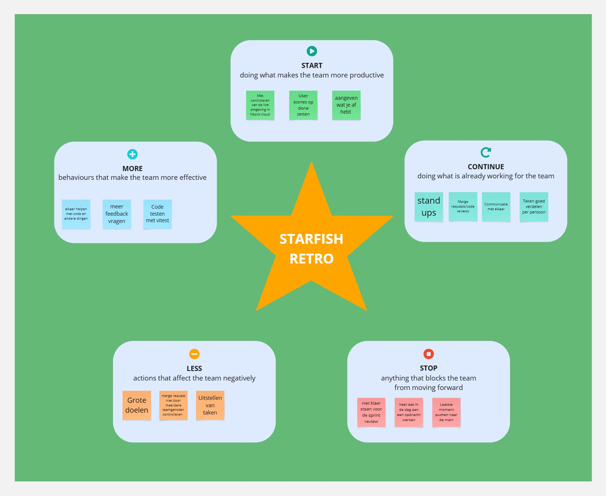

Situatie:
We werkten aan de ontwikkeling van een game-webshop, waarbij elk teamlid verantwoordelijk was voor een specifieke pagina. Miguel werkte aan de Games-pagina en My Games-pagina. Omar werkte aan de Checkout-pagina en de Winkelmand. Akif nam de Home- en Game-info-pagina op zich, en Zoiye werkte aan de Inlog-/Registreerpagina.

Taak:
Onze taak was om elk een vertical slice op te leveren en deze te realiseren aan de hand van vooraf opgestelde user stories. We hebben deze user stories gewogen met behulp van sprintpoker en verdeeld onder de teamleden.

Actie:
We hebben allemaal onze pagina’s gebouwd. De meeste pagina’s zijn visueel afgerond. De Winkelmand en Checkout-pagina functioneren echter nog niet volledig. De Game-info-pagina is grotendeels werkend, maar vereist nog enkele aanpassingen.

Resultaat:
We hebben ons sprintdoel niet gehaald. Hoewel we tevreden zijn met wat we hebben bereikt, bleek het doel te groot voor de beschikbare tijd. We realiseerden ons dat we onze ambities beter hadden moeten afstemmen op de realiteit van de sprintduur.

# Reflectie:
Voor de volgende sprint zullen we beter afstemmen met de productowner om het belangrijkste werk te prioriteren. We stellen een realistischer doel dat beter past bij de tijd en middelen die we hebben. Hierdoor vergroten we de kans op het behalen van het sprintdoel en behouden we de motivatie binnen het team.

# Verbeter doel voor sprint 2:
Als doel hebben we dat wij realiste doelen gaan opstellen voor ons zelf. Dit gaan we bereiken door te kijken wat er echt nodig is van de P.O. en daarvoor kleine taken te maken. Ook zullen we meer tijd nemen tijdens de sprint poker en regelmatig te voortgang te checken tijdens de daily standup.

# Sprint 2 doel:
Omar:
Winkelmand afmaken.
Afrekeken afmaken.
Afrkenen koppelen aan thridparty api

Miguel:
Filteren games
Sorteren games
Zoeken games
