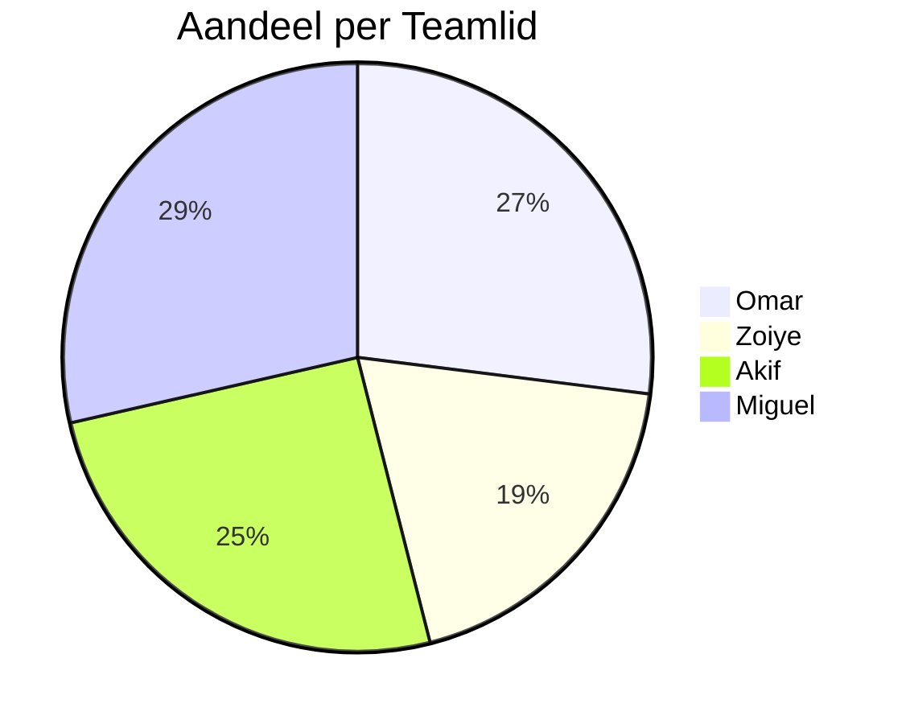

# Retrospective sprint 5

## 1. Vertical slices per teamlid 

### Sprint 4

**Miguel:**

| 1 | 2 |
| --- | --- |
|  |  |

**Zoiye:**

| 1 | 2 |
| --- | --- |
|  |  |

Beschrijving: 

**Akif**

| 1 | 2 |
| --- | --- |
|  |  |

**Omar**

| 1 | 2 |
| --- | --- |
|  | nvt |

### Sprint 5

**Miguel:**

| 1 | 2 |
| --- | --- |
|  |  |

**Zoiye:**

| 1 | 2 |
| --- | --- |
|  |  |

**Akif**

| 1 | 2 |
| --- | --- |
|  |  |

**Omar**

| 1 | 2 |
| --- | --- |
|  |  |

## 2. Aandeel per teamlid 

Dit is de weight van de user stories die we in sprint 5 hebben afgerond. Het valt ons op dat we best wel gelijk op lopen. Alleen Zoiye ligt iets onder de rest van het team, dit komt omdat hij geen user stories van sprint 4 naar sprint 5 had gehaald. We zijn blij met de taakverdeling en we hebben geen onenigheden over de hoeveel ieder doet.

## 3. Retrospective

a. We hebben allemaal een mop verteld, dit zorgte voor een leuke sweer.
b. ons vorige doel was:

Als doel hebben we dat wij realiste doelen gaan opstellen voor ons zelf. Dit gaan we bereiken door te kijken wat er echt nodig is van de P.O. en daarvoor kleine taken te maken. Ook zullen we meer tijd nemen tijdens de sprint poker en regelmatig te voortgang te checken tijdens de daily standup.

#### Reflectie op verbeterdoel:

We hebben zeker meetbare processie gemaakt in ons verbeterdoel. Hoewel we hier nog niet tevreden mee zijn. We hebben namelijk nog user stories van sprint 5 naar sprint 6 verplaatst, omdat we hier niet aan toe zijn gekomen. Dit waren wel extra taken en hinderde ons sprintdoel niet. 

cdef

"

g. 

Punten die ons zijn opgevallen door het dot voten.

| verbeter punt | eigenaar |
| --- | --- |
| Sprintboard bijhouden | Omar |
| Gebruikers testen | Zoiye |
| Afstemmen op elkaar | Miguel |

1. We houden het sprintbord beter bij door elke week een meeting te organiseren om het sprintbord te checken en te updaten.
2. Bij afronding van een user story doen we een gebruikers test, ook zullen we na nieuw toegevoegde features de flow van de website laten controleren door gebruikers.
3. De volgende scrum master zal beter op de verwachtingen van het team afstemmen. Dit zullen wij bereiken doordat we een gesprek aan het begin van de sprint gaan houden over wat ieder individueel verwacht van de scrum master. 

## 4. Feedback

We geven feedback op elkaar, hiervoor gebruiken we de ik en jij methode.

### Feedback Omar:

-
Akif vind dat Omar meer realistische doelen moet stellen. Een voorbeeld hiervan is bijvoorbeeld dat Omar zijn sprintdoel van sprint 4 niet is nagekomen. Omar is het hier mee eens. Een oplossing zou kunnen zijn om eerst voor zichzelf te bedenken wat hij kan en dus haalbaar is voor hem.

Miguel en Zoiye vinden dat Omar iets meer actief kan zijn in de communicatie, met name in discord. Een voorbeeld hiervan is dat Omar thuis moeilijk bereikbaar is en zo moeilijk is om dingen te communiceren. Omar is het hiermee eens. Een oplossing hiervoor is door notificaties aan te zetten voor discord.

+
Miguel vind het fijn dat Omar altijd aanwezig is en goed dat hij altijd zijn best doet.

Akif waardeert dat Omar altijd zijn best doet en dat hij bespreekt als hij tegen dingen aanloopt.

Zoiye vind het goed dat Omar altijd voor een goede sweer zorgt in het groepje en elkaar naar elkaar toe trekt.

### Feedback Akif:

-
Zoiye vind dat Akif iets meer initiatief kan nemen en zijn eigen mening kan geven, inplaats van andere mensen te vragen en op andere mensen te wachten. Akif is er mee eens. Akif neemt aan om vaker zijn ideeën door te geven en zijn eigen mening door te geven.

Miguel vind dat Akif zijn taken beter moet inplannen. Een voorbeeld hiervan is dat hij bijvoorbeeld sommige dagen niks doet en andere dagen tot 2 uur snachts bezig is. Akif heeft gelijk. Akif zal in het vervolg eerder beginnen zodat hij niet alles last moment moet afronden.

Omar vind dat Akif nog verbetering kan vorderen met optijd komen in de les, meestal komt Akif iets later. Akif is het hiermee eens, en zal in het vervolg eerder van huis vertrekken.

+
Omar vind Akif een harde werker en waardeert de samenwerking met hem.

Miguel vind het fijn dat Akif communiceert over code en zorgt dat de website op elkaar is afgestemd, zo verloopt de samenwerking beter.

Zoiye vind dat Akif heel goed zijn taken naloopt en heeft ook door dat Akif zijn best doet om een goed eindproduct neer te zetten als team.

### Feedback Zoiye:
-
Omar vind dat Zoiye te weinig de Daily standup heeft uitgevoerd, en dit dus meer kon uitvoeren. Zoiye is het hiermee eens en zal het meenemen voor de volgende keer als scrum master. Dit gaat hij doen door meer behoeftes af te stemmen met zijn teamgenoten.

Akif vind dat Zoiye zijn afspraken beter na kan komen/ realistischer kan instellen. Zoiye had namelijk niet al zijn user stories af van sprint 5. Zoiye vind dit ook zegt dat dit vooral komt doordat hij alles uitstelt. Hij zal in het vervolg hieraan werken door een goede start te maken van de sprint.

+
Omar waardeert Zoiye als scrummaster en vind hem ook een harde werker.

Miguel waardeert het altijd dat Zoiye initiatiefen neemt.

Akif waardeert dat Zoiye het bestuur neemt en andere mensen helpt als ze niet wisten wat ze moesten maken.

### Feedback Miguel:

-
Omar vind dat Miguel meer mensen kan aansturen in het process omdat hij vaker eerder klaar is met zijn taken/meer ervaring heeft dan de rest van het groepje. Miguel begrijpt het wel, en wil dit best vaker doen. Alleen dit is natuurlijk geen verplichting maar vrijwillig.

+
Omar vind het goed dat Miguel iedereen helpt in de klas.

Akif waardeert het dat Miguel altijd iedereen helpt en altijd klaar staat.

Zoiye waardeert het dat Miguel altijd bereikbaar is en zijn kennis gebruikt om mensen te helpen. Hij geeft om het project en om de mensen om hem heen en doet zijn best om het eindresultaat zo goed mogelijk te maken.

