# Retrospective Verslag Sprint 5

## Aanwezigheid
**Aanwezig:** Miguel, Zoiye, Akif, Omar  
**Afwezig:** Niemand - volledige teamopkomst

# Retrospective sprint 5

## 1. Vertical slices per teamlid 

### Sprint 4

**Miguel:**

| 1 | 2 |
| --- | --- |
| 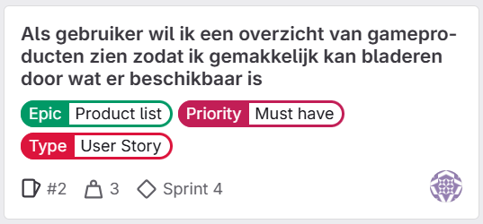 | 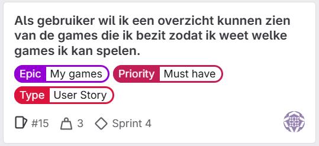 |

**Zoiye:**

| 1 | 2 |
| --- | --- |
| 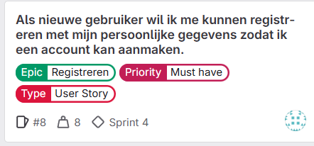 | 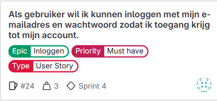 |

Beschrijving: 

**Akif**

| 1 | 2 |
| --- | --- |
| 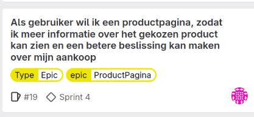 | 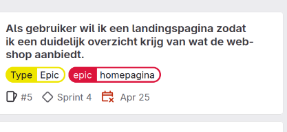 |

**Omar**

| 1 | 2 |
| --- | --- |
| 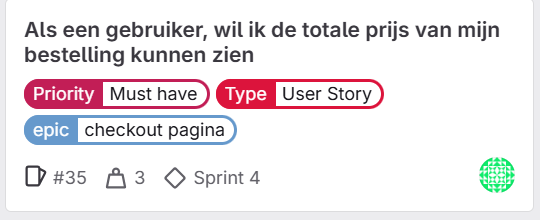 | nvt |

### Sprint 5

**Miguel:**

| 1 | 2 |
| --- | --- |
| 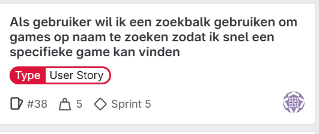 | 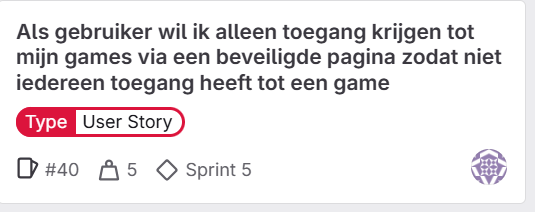 |

**Zoiye:**

| 1 | 2 |
| --- | --- |
| 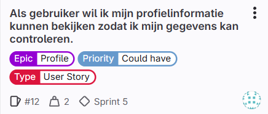 |  |

**Akif**

| 1 | 2 |
| --- | --- |
| 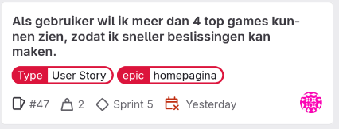 | 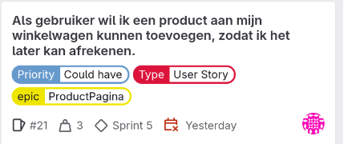 |

**Omar**

| 1 | 2 |
| --- | --- |
| 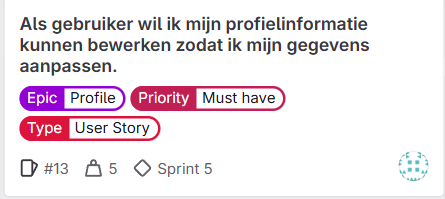 |  |

## 2. Aandeel per teamlid 

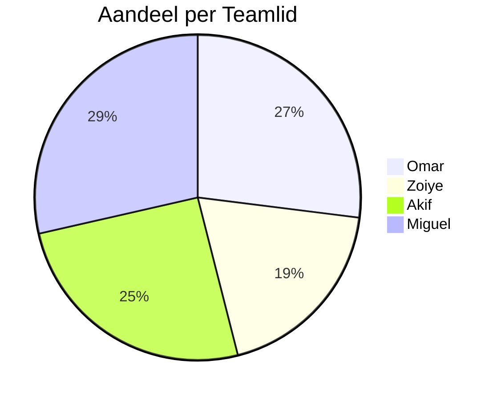

Dit is de weight van de user stories die we in sprint 5 hebben afgerond. Het valt ons op dat we best wel gelijk op lopen. Alleen Zoiye ligt iets onder de rest van het team, dit komt omdat hij geen user stories van sprint 4 naar sprint 5 had gehaald. We zijn blij met de taakverdeling en we hebben geen onenigheden over de hoeveel ieder doet.

## 3. Retrospective Bevindingen

### Vorig Verbeterdoel
Het team had als doel gesteld om realistischere doelen op te stellen door:
- Beter te analyseren wat de Product Owner werkelijk nodig heeft
- Kleinere, haalbaardere taken te creëren
- Meer tijd te besteden aan sprint planning poker
- Regelmatigere voortgangscontrole tijdens daily standups

### Reflectie op Verbeterdoel
Het team heeft meetbare vooruitgang geboekt, maar is nog niet volledig tevreden. Er zijn nog steeds user stories van Sprint 5 naar Sprint 6 verplaatst, hoewel dit extra taken betrof die het sprintdoel niet hinderden.

### Nieuwe Verbeterpunten (via dot voting)
Het team heeft drie hoofdverbeterpunten geïdentificeerd:

1. **Sprintboard bijhouden (eigenaar: Omar)**
   - *Actie:* Wekelijkse meetings organiseren om het sprintboard te controleren en updaten

2. **Gebruikerstesten (eigenaar: Zoiye)**  
   - *Actie:* Bij afronding van elke user story een gebruikerstest uitvoeren
   - *Actie:* Na nieuwe features de complete website flow laten testen door gebruikers

3. **Afstemmen op elkaar (eigenaar: Miguel)**
   - *Actie:* De volgende scrum master zal aan het begin van elke sprint individuele verwachtingen bespreken met teamleden

## 4. Individuele Feedback

Het team heeft feedback uitgewisseld volgens de "ik en jij" methode:

### Feedback Omar:

**Verbeterpunten (-)**
- Akif vindt dat Omar meer realistische doelen moet stellen. Een voorbeeld hiervan is dat Omar zijn sprintdoel van sprint 4 niet is nagekomen. Omar is het hiermee eens. Een oplossing zou kunnen zijn om eerst voor zichzelf te bedenken wat hij kan en dus haalbaar is voor hem.
- Miguel en Zoiye vinden dat Omar iets meer actief kan zijn in de communicatie, met name in discord. Een voorbeeld hiervan is dat Omar thuis moeilijk bereikbaar is en zo moeilijk is om dingen te communiceren. Omar is het hiermee eens. Een oplossing hiervoor is door notificaties aan te zetten voor discord.

**Positieve punten (+)**
- Miguel vindt het fijn dat Omar altijd aanwezig is en goed dat hij altijd zijn best doet.
- Akif waardeert dat Omar altijd zijn best doet en dat hij bespreekt als hij tegen dingen aanloopt.
- Zoiye vindt het goed dat Omar altijd voor een goede sfeer zorgt in het groepje en elkaar naar elkaar toe trekt.

### Feedback Akif:

**Verbeterpunten (-)**
- Zoiye vindt dat Akif iets meer initiatief kan nemen en zijn eigen mening kan geven, inplaats van andere mensen te vragen en op andere mensen te wachten. Akif is er mee eens. Akif neemt aan om vaker zijn ideeën door te geven en zijn eigen mening door te geven.
- Miguel vindt dat Akif zijn taken beter moet inplannen. Een voorbeeld hiervan is dat hij bijvoorbeeld sommige dagen niks doet en andere dagen tot 2 uur 's nachts bezig is. Akif heeft gelijk. Akif zal in het vervolg eerder beginnen zodat hij niet alles last moment moet afronden.
- Omar vindt dat Akif nog verbetering kan vorderen met op tijd komen in de les, meestal komt Akif iets later. Akif is het hiermee eens, en zal in het vervolg eerder van huis vertrekken.

**Positieve punten (+)**
- Omar vindt Akif een harde werker en waardeert de samenwerking met hem.
- Miguel vindt het fijn dat Akif communiceert over code en zorgt dat de website op elkaar is afgestemd, zo verloopt de samenwerking beter.
- Zoiye vindt dat Akif heel goed zijn taken naloopt en heeft ook door dat Akif zijn best doet om een goed eindproduct neer te zetten als team.

### Feedback Zoiye:

**Verbeterpunten (-)**
- Omar vindt dat Zoiye te weinig de Daily standup heeft uitgevoerd, en dit dus meer kon uitvoeren. Zoiye is het hiermee eens en zal het meenemen voor de volgende keer als scrum master. Dit gaat hij doen door meer behoeftes af te stemmen met zijn teamgenoten.
- Akif vindt dat Zoiye zijn afspraken beter na kan komen/ realistischer kan instellen. Zoiye had namelijk niet al zijn user stories af van sprint 5. Zoiye vindt dit ook zegt dat dit vooral komt doordat hij alles uitstelt. Hij zal in het vervolg hieraan werken door een goede start te maken van de sprint.

**Positieve punten (+)**
- Omar waardeert Zoiye als scrummaster en vindt hem ook een harde werker.
- Miguel waardeert het altijd dat Zoiye initiatieven neemt.
- Akif waardeert dat Zoiye het bestuur neemt en andere mensen helpt als ze niet wisten wat ze moesten maken.

### Feedback Miguel:

**Verbeterpunten (-)**
- Omar vindt dat Miguel meer mensen kan aansturen in het proces omdat hij vaker eerder klaar is met zijn taken/meer ervaring heeft dan de rest van het groepje. Miguel begrijpt het wel, en wil dit best vaker doen. Alleen dit is natuurlijk geen verplichting maar vrijwillig.

**Positieve punten (+)**
- Omar vindt het goed dat Miguel iedereen helpt in de klas.
- Akif waardeert het dat Miguel altijd iedereen helpt en altijd klaar staat.
- Zoiye waardeert het dat Miguel altijd bereikbaar is en zijn kennis gebruikt om mensen te helpen. Hij geeft om het project en om de mensen om hem heen en doet zijn best om het eindresultaat zo goed mogelijk te maken.
