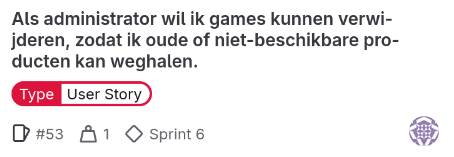
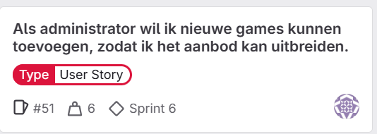
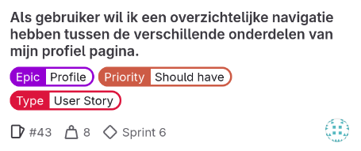
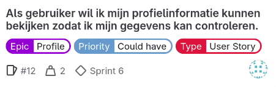
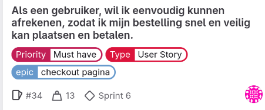
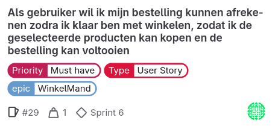
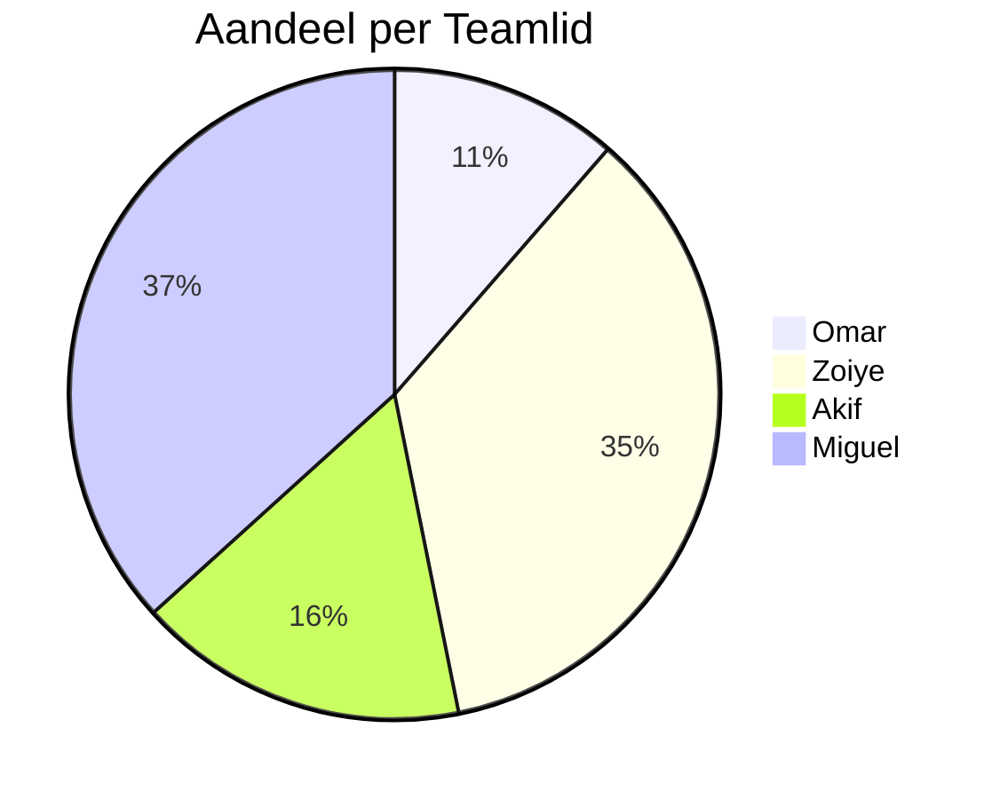
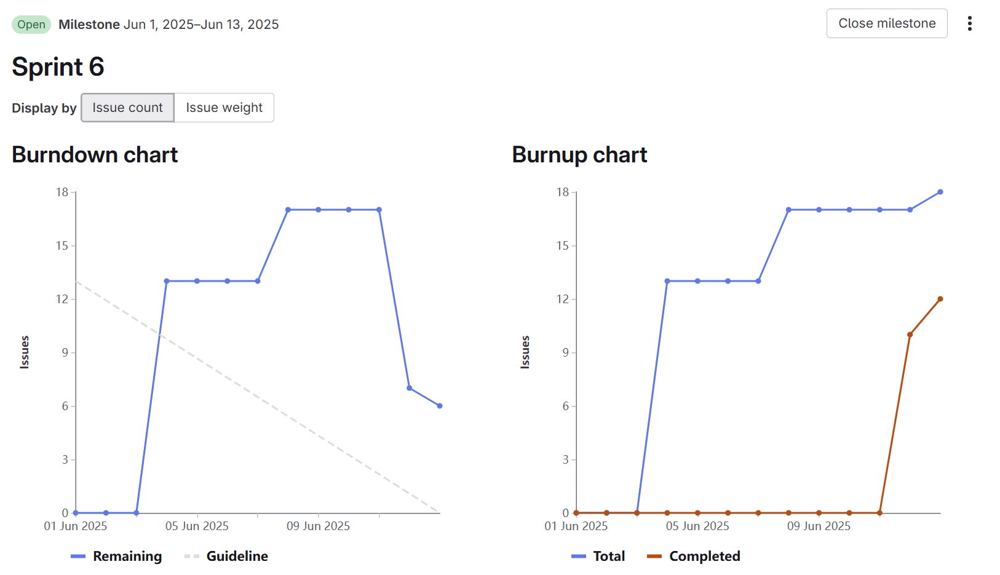

# Retrospective Verslag Sprint 6

## Aanwezigheid
**Aanwezig:** Miguel, Zoiye, Akif, Omar  
**Afwezig:** Niemand - volledige teamopkomst

# Retrospective sprint 6

## 1. Vertical slices per teamlid 

**Miguel:**
| 1 | 2 |
| --- | --- |
|  |  |

**Zoiye:**
| 1 | 2 |
| --- | --- |
|  |  |

**Akif**
| 1 | 2 |
| --- | --- |
|  | |

**Omar**
| 1 | 2 |
| --- | --- |
|  | |

## 2. Aandeel per teamlid 

Dit is de weight van de user stories die we in sprint 6 hebben afgerond. Het team heeft in totaal 78 punten behaald, wat een verbetering is ten opzichte van de vorige sprint.

We zien dat er wel wat verschillen zijn in de verdeling van de punten per teamlid, maar dat is te verklaren door de verschillende taken en verantwoordelijkheden die ieder teamlid heeft. Zo hebben Zoiye en Miguel meer user stories afgerond, omdat zij zich meer hebben gefocust op de front-end en back-end ontwikkeling, terwijl Akif en Omar zich meer hebben gericht op de integratie en testing van de website.

## 3. Burndown en Burnup Chart

## 4. Retrospective Bevindingen

### Vorig Verbeterdoel
1. **Sprintboard bijhouden (eigenaar: Omar)**
   - *Actie:* Wekelijkse meetings organiseren om het sprintboard te controleren en updaten

2. **Gebruikerstesten (eigenaar: Zoiye)**  
   - *Actie:* Bij afronding van elke user story een gebruikerstest uitvoeren
   - *Actie:* Na nieuwe features de complete website flow laten testen door gebruikers

3. **Afstemmen op elkaar (eigenaar: Miguel)**
   - *Actie:* De volgende scrum master zal aan het begin van elke sprint individuele verwachtingen bespreken met teamleden

### Reflectie op Verbeterdoel

### Nieuwe Verbeterpunten (via dot voting)

## 5. Individuele Feedback
Het team heeft feedback uitgewisseld volgens de "ik en jij" methode:

### Feedback Omar:

**Verbeterpunten (-)**

**Positieve punten (+)**

### Feedback Akif:

**Verbeterpunten (-)**

**Positieve punten (+)**

### Feedback Zoiye:

**Verbeterpunten (-)**

**Positieve punten (+)**

### Feedback Miguel:

**Verbeterpunten (-)**

**Positieve punten (+)**
