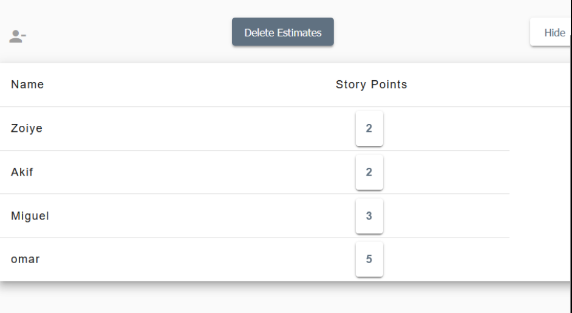
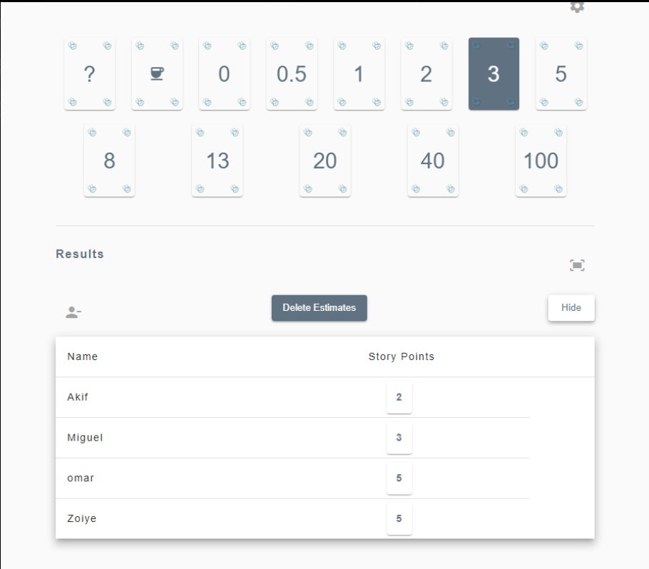
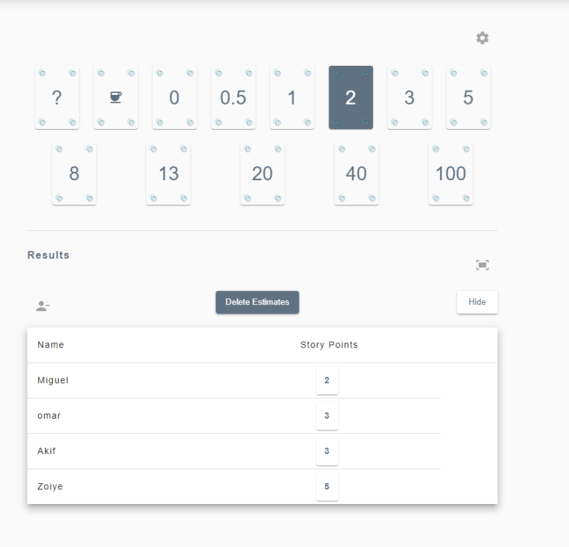

Wij hebben user story 35 besproken "Als een gebruiker, wil ik de totale prijs van mijn bestelling kunnen zien". Hierbij gaven Akif en Zoiye een 2, Miguel een 3 en Omar een 5.

Omar gaf aan dat het misschien lastig omdat je de actuele prijzen moet ophalen uit de database.
Zoiye en Akif geven aan dat het opzich makkelijk is omdat je een simpele SQL query kan doen om te totale bedrag op te halen.
Miguel geeft aan dat je de prijzen misschien uit een third party api moet ophalen en dat het dan ietjes moeilijker is met berekenen.

Uiteindelijk zijn we op een 3 gekomen

Wij hebben user story 26 besproken "Als gebruiker wil ik de optie hebben om ingelogd te blijven zodat ik niet elke keer opnieuw hoef in te loggen.
". Hierbij gaven Omar en Zoiye een 5, Miguel een 3 en Akif een 2.

Akif geeft aan dat je alleen de sessie op te slaan en deze sessie gebruiken om ingelogd te blijven.
Miguel geeft ook aan dat je alleen een sessie op te slaan maar dat het misschien lastiger wordt als je 2 opties hebt tussen ingelogd blijven en niet ingelogd blijven.

De rest is er mee eens en we zijn op een 3 uitgekomen

Wij hebben user story 22 besproken "Als gebruiker wil reviews van het product kunnen zien, zodat ik zeker weet of het product waard is". Hierbij gaf Omar, Akif en Miguel een 8 en Zoiye een 13.

Zoiye geeft aan dat het best veel is omdat je een ook een review moet kunnen aanmaken en moet laten zien. Dit kan je beter opsplitsen tussen 2 user stories.
Miguel geeft ook aan dat je reviews als gebruiker alleen kan plaatsen als je een account hebt, review nog niet hebt geplaatst en dat je het spel hebt gekocht.

Wij zijn er mee ens dat het een 13 is en dat we dit moeten opsplisten tussen 2 user stories.

Wij hebben user story 13 besproken "Als gebruiker wil reviews van het product kunnen zien, zodat ik zeker weet of het product waard is". Hierbij gaf Omar en Akif een 3, Miguel een 2 en Zoiye een 5.

Zoiye geeft aan dat je ook de gebruikers data moet valideren, zo moet je bijvoorbeeld een verificatie email sturen als de email aangepast wordt, wachtwoord moet gecontroleerd worden en adres/postcode.

Dit was een goed punt en de rest sluit zich aan op een 5. 
