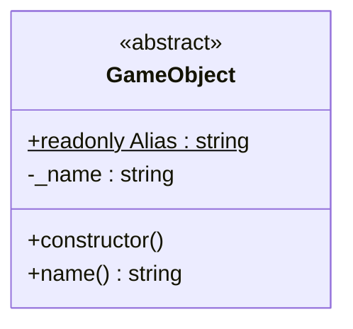

# Documentatie
Tijdens het project is het belangrijk allerlei informatie vast te leggen, zowel voor jezelf als voor LucaStars. Denk hierbij aan je Functioneel ontwerp, Technisch ontwerp, Think-Make-Check cycli, Retrospectives, Portfolio, Samenwerkingscontract, enzovoorts.

## Documentatie site genereren en bekijken
1. Voer `npm run typedoc` uit
2. Controleer eventueel waarschuwingen en foutmeldingen.

    > **Let op!** Alle geschreven code wordt gecontroleerd op de correcte aanwezigheid van [TSDoc](https://tsdoc.org/). Bij het ontbreken hiervan krijg je een waarschuwing. Onze tip? Los dit direct op!

3. Open de `dist/docs/index.html` in je browser.

## Een document toevoegen
1. Maak een Markdown-bestand in de `docs`-map aan, bijvoorbeeld `portfolio.md`.
2. Voeg een [*frontmatter*](https://typedoc.org/documents/External_Documents.html#document-content) blok aan je `portfolio.md` toe met in ieder geval de `title` van de pagina. Deze zal zichtbaar worden in de navigatie op de site.

    Bijvoorbeeld:
    ```yaml
    ---
    title: Portfolio
    ---
    # Portfolio
    Lorem ipsum
    ```

3. Pas het *frontmatter* blok van `docs/index.md` aan en voeg `portfolio.md` toe aan de lijst van `children`.

    Bijvoorbeeld:
    ```yaml
    ---
    title: Documentatie
    children:
        - game-design-document.md
        - portfolio.md
        - retrospectives.md
    ---
    ```

    > **Let op!** De volgorde van de lijst van `children` bepaald ook de volgorde in de navigatie!

4. Genereer je site opnieuw en bekijk het resultaat.

## Structuur in documenten aanbrengen
Documenten kunnen in een mappenstructuur gezet worden, waarbij de navigatie deze structuur zal tonen.

1. Maak een nieuwe map aan in `docs`, bijvoorbeeld `retrospectives`.
2. Voeg een `retrospectives/index.md` toe en geef deze een *frontmatter* blok met een `title`, zoals eerder in dit document is beschreven.
3. Voeg daarnaast één of meerdere Markdown-bestanden aan de `test-map` toe, bijvoorbeeld `test-map/sprint-1.md` en `test-map/sprint-2.md`.
4. Voeg vervolgens een lijst van `children` toe aan het *frontmatter* blok van de `retrospectives/index.md` met verwijzingen naar de gewenste Markdown bestanden.

    Voorbeeld van `retrospectives/index.md`:
    ```yaml
    ---
    title: "Retrospectives"
    children:
        - sprint-1.md
        - sprint-2.md
    ---
    # Retrospectives
    Lorem ipsum
    ```
5. Pas het *frontmatter* blok van `docs/index.md` aan en voeg `retrospectives/index.md` toe aan de lijst van `children`.
6. Genereer je site opnieuw en bekijk het resultaat.

## Overige tips

### Mermaid diagrammen
Het is mogelijk om [Mermaid](https://mermaid.js.org/intro/) diagrammen aan je pagina toe te voegen.

Bijvoorbeeld:


