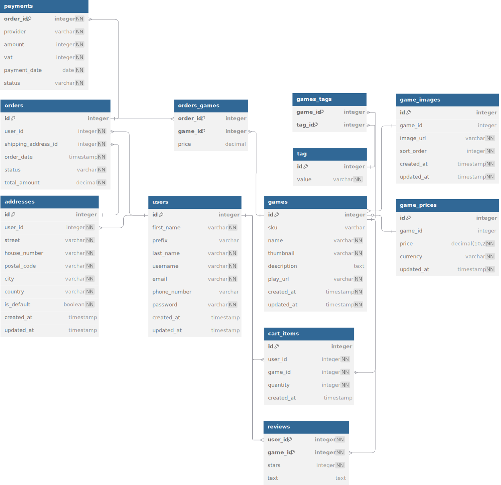

# EERD



Wij hebben de EERD in [dbdiagram](https://dbdiagram.io/) gemaakt.

```DBML
// Use DBML to define your database structure
// Docs: https://dbml.dbdiagram.io/docs

Table games {
  id integer [pk] 
  sku varchar [unique]
  name varchar [not null]
  thumbnail varchar [not null]
  description text
  play_url varchar [not null]
  created_at timestamp [not null, default: "now()"]
  updated_at timestamp [not null, default: "now()"]
}

Table game_images {
  id integer [pk]
  game_id integer [ref: < games.id]
  image_url varchar [not null]
  sort_order integer [not null, default: 1]
  created_at timestamp [not null, default: "now()"]
  updated_at timestamp [not null, default: "now()"]
}

Table game_prices {
  id integer [pk]
  game_id integer [ref: - games.id]
  price decimal(10, 2) [not null]
  currency varchar [not null]
  updated_at timestamp [not null, default: "now()"]
}

Table tag {
  id integer [pk]
  value varchar [not null]
}

Table games_tags {
  game_id integer [pk, ref: > games.id]
  tag_id integer [pk, ref: > tag.id]
}

Table users {
  id integer [primary key]
  first_name varchar [not null, note: 'First name']
  prefix varchar [note: 'Middle name prefix (optional)']
  last_name varchar [not null, note: 'Last name']
  username varchar [unique, not null]
  email varchar [unique, not null]
  phone_number varchar
  password varchar [not null]
  created_at timestamp
  updated_at timestamp
}

Table addresses {
  id integer [primary key]
  user_id integer [not null, ref: > users.id]
  street varchar [not null]
  house_number varchar [not null]
  postal_code varchar [not null]
  city varchar [not null]
  country varchar [not null]
  is_default boolean [not null, default: false]
  created_at timestamp
  updated_at timestamp
}

Table orders {
  id integer [primary key]
  user_id integer [not null, ref: > users.id]
  shipping_address_id integer [not null, ref: > addresses.id]
  order_date timestamp [not null]
  status varchar [not null]
  total_amount decimal [not null]
}

Table orders_games {
  order_id integer [pk, ref: > orders.id]
  game_id integer [pk, ref: > games.id]
  price decimal
}

Table payments {
  order_id integer [not null, pk, ref: > orders.id]
  provider varchar [not null]
  amount integer [not null]
  vat integer [not null]
  payment_date date [not null]
  status varchar [not null]
}

Table cart_items {
  id integer [pk]
  user_id integer [not null, ref: > users.id]
  game_id integer [not null, ref: > games.id]
  quantity integer [not null, default: 1]
  created_at timestamp [default: "now()"]
}

Table reviews {
  user_id integer [not null, pk, ref: > users.id]
  game_id integer [not null, pk, ref: > games.id]
  stars integer [not null]
  text text [null]
}
```
