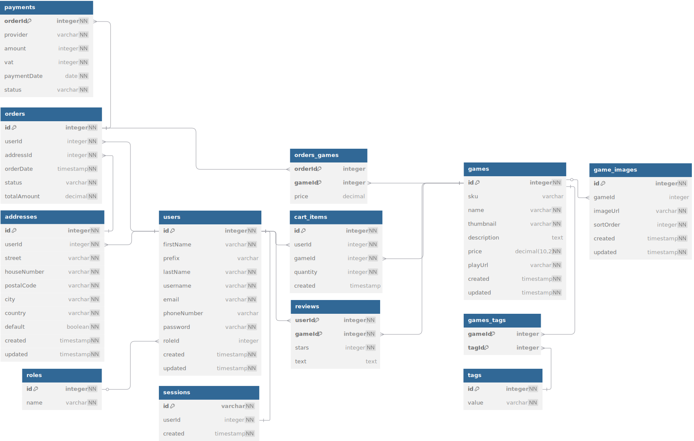

# ERD



Wij hebben de ERD in [dbdiagram](https://dbdiagram.io/) gemaakt.

```DBML
// Use DBML to define your database structure
// Docs: https://dbml.dbdiagram.io/docs

Table games {
  id integer [pk] 
  sku varchar [unique]
  name varchar [not null]
  thumbnail varchar [not null]
  description text
  playUrl varchar [not null]
  created timestamp [not null, default: `now()`]
  updated timestamp [not null, default: `now()`]
}

Table game_images {
  id integer [pk]
  gameId integer [ref: > games.id]
  imageUrl varchar [not null]
  sortOrder integer [not null, default: 1]
  created timestamp [not null, default: `now()`]
  updated timestamp [not null, default: `now()`]
}

Table game_prices {
  id integer [pk]
  gameId integer [ref: - games.id]
  price decimal(10, 2) [not null]
  currency varchar [not null]
  updated timestamp [not null, default: `now()`]
}

Table tags {
  id integer [pk]
  value varchar [not null]
}

Table games_tags {
  gameId integer [pk, ref: > games.id]
  tagId integer [pk, ref: > tags.id]
}

Table users {
  id integer [primary key]
  firstName varchar [not null, note: 'First name']
  prefix varchar [note: 'Middle name prefix (optional)']
  lastName varchar [not null, note: 'Last name']
  username varchar [unique, not null]
  email varchar [unique, not null]
  phoneNumber varchar
  password varchar [not null]
  created timestamp [not null, default: `now()`]
  updated timestamp [not null, default: `now()`]
}

Table addresses {
  id integer [primary key]
  userId integer [not null, ref: > users.id]
  street varchar [not null]
  houseNumber varchar [not null]
  postalCode varchar [not null]
  city varchar [not null]
  country varchar [not null]
  default boolean [not null, default: false]
  created timestamp [not null, default: `now()`]
  updated timestamp [not null, default: `now()`]
}

Table orders {
  id integer [primary key]
  userId integer [not null, ref: > users.id]
  addressId integer [not null, ref: > addresses.id]
  orderDate timestamp [not null]
  status varchar [not null]
  totalAmount decimal [not null]
}

Table orders_games {
  orderId integer [pk, ref: > orders.id]
  gameId integer [pk, ref: > games.id]
  price decimal
}

Table payments {
  orderId integer [not null, pk, ref: > orders.id]
  provider varchar [not null]
  amount integer [not null]
  vat integer [not null]
  paymentDate date [not null]
  status varchar [not null]
}

Table cart_items {
  id integer [pk]
  userId integer [not null, ref: > users.id]
  gameId integer [not null, ref: > games.id]
  quantity integer [not null, default: 1]
  created timestamp [default: `now()`]
}

Table reviews {
  userId integer [not null, pk, ref: > users.id]
  gameId integer [not null, pk, ref: > games.id]
  stars integer [not null]
  text text [null]
}

Table sessions {
  id varchar [not null, pk]
  userId integer [not null, ref: - users.id]
  created timestamp [not null, default: `now()`]
}
```
